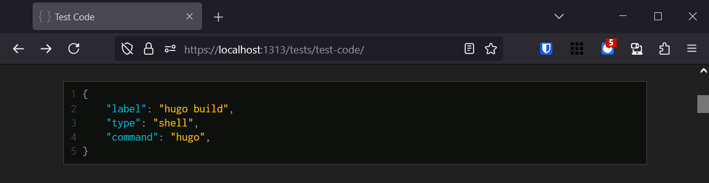

+++
title = 'Hello World'
aliases = [ '0' ]
date = 2025-02-23
hidden = true
+++

Hi. Over the last couple of years I've been getting the urge to write. I've been making games for the last decade so it'll mostly be about programming in the context of video games, with a particular interest in general purpose game engines. But, seeing as this is my first post, it'll be about building the blog itself. Trite, maybe, but hopefully at least a little interesting. It's structured more like a journal of the process than a nice linear story. Sorry if it's a bit dry in places.

Before this, I had precisely zero experience with anything web related (other than dabbling with WASM, which doesn't count). There's just over a year between my first commit and this post, with the work happening in fits and starts. I take my time when learning and I'm a perfectionist, which can be a lethal combination at times. I also got caught in up the game industry apocalypse and spent 5 months goofing off and building a game engine with a couple of friends in between jobs. Severance is a lovely thing. Now I have a lean website with zero dependencies that I control every aspect of and I'm thrilled with the result.

## How do you make a website?

The first step was deciding how to even make a website. What do you need? Hosting, I guess. Maybe a domain. HTML and CSS files. That's the extent of my knowledge at this point. With a bit of searching I found the concept of static site generators - you write plain text in a markup language and a tool parses it to generate HTML and CSS. I'm a minimalist and I like having access to the fundamental interface I'm working with, so this seemed like a good fit. I had also just read a couple of great posts about [markup languages](https://matklad.github.io/2022/10/28/elements-of-a-great-markup-language.html) and [generating HTML](https://www.devever.net/~hl/stringtemplates) (which foreshadows some of my complaints with the solution I landed on), so I had some idea about the process of transforming markup into HTML.

There are many options for [static site generators](https://jamstack.org/generators/). [Jekyll](https://jekyllrb.com/) seemed to be one of the more popular options so I started with that. I got two paragraphs into the Quickstart. Prerequisites: Ruby, RubyGems, GCC, and Make. A big part of the appeal of a static site generator is the simplicity and I know nothing about Ruby. I don't want to learn a programming language or environment on top of learning how to make a website. I want a single command line tool with no dependencies (an opinion later reinforced by [complaints](https://gamesbymason.com/blog/2025/zine/) about dealing with Ruby dependencies). I also recall comments about Jekyll being slow.

I briefly considered making my own, but that seemed like a bad idea when I don't know much about the thing I'm generating. Hugo and Sphinx were also recommended. Sphinx is written in Python, which I'm not wild about, but at least familiar with. I've used it to slap together reporting for automated tests at work and ripped apart a library to learn how to implement [SPI](https://en.wikipedia.org/wiki/Serial_Peripheral_Interface) but nothing non-trivial. For a markup language it uses reStructured Text (RST) and I figured using a more common format like Markdown made sense. I didn't look at the installation process, but I imagine it's analogous to the situation with Jekyll. I decided against it fairly quickly.

Hugo was up next. The first bullet on the [landing page](https://gohugo.io/) is about speed and that's a good sign. It's written in Go, a language I've dabbled in and have a passing interest in. Naively, the language a tool is built in shouldn't matter, but in practice it often does (as we'll see later). Hugo is distributed as a prebuilt binary available via `winget` and this is a big pro. Poking through the themes, there were a few that stood out to me. At this point I was itching to get started so I decided to give it a shot.

## Hosting

This ended up being an easy choice. [Github Pages](https://pages.github.com/) offers free hosting. I remember looking at a couple of other options, but I was pretty well set on Pages from the start. I can push changes from the command line and use Github Actions to build and deploy the site. The Hugo documentation provides a template for a basic [Actions workflow](https://gohugo.io/hosting-and-deployment/hosting-on-github/) and the [final product](https://github.com/akbyrd/akbyrd.github.io/blob/main/.github/workflows/hugo.yaml) is reasonable. It takes about 30 seconds from pushing until I can see the result deployed live. Most of that time is overhead from Actions spinning up machines. I don't have a need for it to be faster, but I've idly wondered if I could run the Actions locally and push to the hidden pages branch directly for faster deployment.

## Domain

Also an easy choice. I picked a name I liked and bought it from the first provider I found with a reasonable price. About $20 a year from Namecheap. I don't think I need any of the extra features like DDoS protection or email service.

One mistake I made here was getting a `.dev` domain. It's cool, but it's also on a special, preloaded HTTP Strict Transport Security list that browsers use to force all traffic to use HTTPS instead of HTTP. Not a problem for this blog, since Github Pages will handle the SSL certificate automatically, but I have an older domain that has a couple of useful DNS redirects. For example, `dotfiles.old.domain` redirects to a PowerShell script on Github that I can download and run on a new machine to quickly set up my typical development environment. Namecheap doesn't handle HTTPS redirects so I can't move this to my new domain. I think other registrars might support this though.

## Hugo

I spent a couple of weeks reading the Hugo docs top to bottom. With so much of the vocabulary being new I found it hard to follow and most of it didn't stick until I started getting my hands dirty. It was part of an experiment to compare a couple of learning approaches that I'll talk more about later.

### Picking a Theme

I want a fairly minimal blog. As I mentioned, [Alex Kladov's blog](https://matklad.github.io/) was a source of inspiration. I think it's a relatively common style - a straight list of articles and not much else. There are plenty of themes for Hugo and [PaperMod](https://themes.gohugo.io/themes/hugo-papermod/) stood out as a good starting point, but that didn't last long.

One of the entirely arbitrary things I wanted was switching between light mode and dark mode to happen smoothly. Not for any other reason than I was curious how to do it (answer: CSS transitions). I started looking through the theme to figure out how the color swap worked so I could modify it. Because Go templates and Hugo were still pretty foreign at this point, I found it tedious. So I deleted it to make my own theme instead. With [blackjack and hookers](https://www.youtube.com/watch?v=e35AQK014tI). It's a bit hard to estimate, but maybe 40% of the time making the blog went into the theme. While it looks minimal, there are some nifty features scattered about.

### TOML

Hugo allows 3 different configuration formats: JSON, TOML, and YAML. I was excited to try TOML on account of how simple and similar to INI it is. I read through [the spec](https://toml.io/en/), which is delightfully small. There are some quirks with the order in which tables can be defined, but overall I like it. Unfortunately, the tooling in VS Code does not spark joy. There's basically one abandoned TOML extension that's littered with bugs. For that reason alone I would prefer to have used a different language.

One cool thing I noticed is that the TOML extension has built-in support for Hugo's config files. Or at least I _thought_ it did, but it turns out it's automatically pulling the schema from [JSON Schema Store](https://www.schemastore.org/json/). JSON schemas are pretty neat and despite the name can be used for other languages as well. Unfortunately, the schema there for Hugo is out of date. Go has reflection so in theory it should be possible to generate the schema automatically from the structs used for config options. I briefly toyed around with implementing this, but the maintainers don't [seem particularly interested](https://github.com/gohugoio/hugo/issues/9725#issuecomment-1079807975) in the idea so I figured it wasn't a good use of time.

### Things I like about Hugo

Using a static site generator was a good choice and there's a lot to like about Hugo.

* It's a single executable with no dependencies.

* It's somewhat fast. It's currently taking 400ms to build ~20 pages. I haven't profiled it yet, but I don't think I'm playing nicely with Hugo's caching system so it's probably doing more work than it needs to. I think it was in the low double digits until recently.

* It uses layered config similar to Git. Both sites and themes can have config, with the site config taking precedence. You have a default configuration in `config/_default`, then environment-specific settings in `config/{development, staging, production}`. The environment config is merged on top of the base config and can override values. So the layer precedence is: site environment > site default > theme environment > theme default. This layered approach is the correct default for tools.

* The core workflow loop is great with hot reloading. You run a local server and see changes in your browser in real time as you work on the site. This works for both the theme and content.

* The documentation is pretty good. It's fairly complete and I've found myself using it frequently. Sometimes it feels a bit out of order and frequently the terminology isn't intuitive but overall I'm quite happy it exists.

### Things I don't like about Hugo

On the other hand, I have quite a few complaints.

* The [layout template lookup order](https://gohugo.io/templates/lookup-order/) is obscene. It's documented only via example as a list of about 600 entries. There is no system or rule and it's rife with inconsistencies. Twice I've analyzed the list to come up with a reasonable pattern to remember how to create a template with a valid name and location. The best I can do is
	```txt {#TemplateLookupOrder}
	home    - layouts[/{<type>|_default}]/{<layout>|index|<kind>|list}.<format>
	section - layouts/{<type>|<section>|<kind>|/_default}/{<layout>|<section>|<kind>|list}.<format>
	single  - layouts/{<section>|_default}/{<layout>|single}.<format>
	```
	And this still leaves out the "baseof" layout templates and doesn't address the order Hugo searches for them.

* Go templates are a bad programming language. I mean, duh, they aren't a programming language. But you're stuck using them like they are. For non-trivial HTML generation you need to perform logic. You're going to be writing a lot of branches, loops, and functions with clumsy syntax and limited semantics. A text templating language is not the right solution. I think an AST-based approach with a real programming language would be far easier to work with.

* The error messages are awful. They don't provide a clear context and are run together on a single line. It's not practical to parse the output using something like VS Code's problem matchers.
	```txt {#ErrorMessages .wrap}
	ERROR render of "D:/Dev/akbyrd.dev/content/tests/6-test-emoji.md" failed: "D:\Dev\akbyrd.dev\layouts\_default\baseof.html:30:9": execute of template failed: template: _default/single.html:30:9: executing "_default/single.html" at <partial "resource" (dict "Name" "favicon.ico" "Rename" false)>: error calling partial: "D:\Dev\akbyrd.dev\layouts\partials\resource.html:67:24": execute of template failed: template: partials/resource.html:67:24: executing "partials/resource.html" at <$resource.Width>: error calling Width: this method is only available for image resources
	```

* Render hooks are a great feature, but they're only available for a few types of content. Render hooks allow you to customize how things get rendered into HTML. Hooks exist for code blocks, images, block quotes, and a few other things. There is no hook for inline code, list items, or any other inline elements. This made it harder to deal with Markdown "task lists" and to add syntax highlighting to inline code. Again, what I really want is an AST based model where I can write custom rendering for any node type.

* The security model is pointlessly restrictive for my use case. You're not able to shell out to another tool from a template. Any feature Hugo doesn't implement natively is impossible to achieve using an existing tool. Want more control over image processing? A more accurate tool for syntax highlighting? Nope and nope. The devs [have](https://github.com/gohugoio/hugo/pull/7529#issuecomment-1111384963) [mentioned](https://github.com/gohugoio/hugo/issues/9460#issuecomment-1029051191) that they don't want running someone elses site on their machine to execute arbitrary code. While that's reasonable, idk, run it in Windows Sandbox or something, but don't hamstring the tool. I don't need my tools to protect me from myself.

* Hot reloading isn't reliable. It works 90% of the time, but it's common to get into situations where changing a file doesn't cause it to rebuild. It's also common to remain stuck in a broken state after fixing a compilation error until you turn it off and back on again.

* Lots of bugs and inconsistent behavior. For a while, building your site would fail with an obscure error if you didn't have a `static` folder at the top level, even if it's empty and you don't need to use it.

* There are 3 versions of Hugo: regular, Extended Edition, and Extended/Deploy Edition. I guess this is about binary size? But we're talking about ~25 MB, so the separation seems largely useless to users.

* It generally takes a "good enough" development approach. Between that and the backwards compatibility goal it has a tendency to end up with unsatisfying solutions. Backwards compatibility in particular is interesting because while I haven't been bitten by it yet, I've seen multiple [complaints](https://commaok.xyz/post/on_hugo/) about how often breaking changes are made. Yet it's also the reason for not improving things like the template lookup order. It seems to be in a middle ground that ends up unsatisfying to both sides.

* Concepts in the docs are sometimes used before they are introduced. Getting Started is currently in the 3rd row of topics on the main page.

* There are weird subtleties like `index.md` being different than `_index.md`.

* At times terminology for different concepts uses synonyms or is ambiguous. Pages have a kind, a type, a format, and a layout and each plays a slightly different role when selecting the layout template that gets used. `Page.IsPage` can return false because while everything is a `Page`, `Page.Kind` may or may not be `page`.

### Overall

I'm happy I chose to use Hugo. It was useful to have guardrails while learning a lot of new stuff all at once. Without it there's a good chance I would have gotten bogged down and shelved the project for a while. That said, by halfway through the site I hit an inflection point where it became more of an obstacle. Not enough that it made sense to switch tools immediately, but enough that I want to make my own static site generator at some point.

As long as you play to its strengths, it's a pleasant tool to use. If you want a site that's easy to get up and running, easy to build and modify, has a good workflow for writing, and want an off-the-shelf theme, it's hard to complain. If you want precise control over the generated HTML or over the theme, you'll want to consider your options. Theming and customizing the generated output in Hugo is clumsy and unpleasant.

I think there's a simpler, more elegant tool trying to get out.

## CSS and HTML

### Learning

After reading the Hugo docs I took some time to read about HTML and CSS. I used this as a chance to experiment with learning approaches. Is it more effective to read the documentation from top to bottom, or to read only the high level parts and fill in gaps over time? My natural tendency is definitely to read everything up front, but over the years I've moved more toward skimming and filling in the gaps due to the usual time pressure of needing to ship something. The problem is I feel too many of the gaps are left unfilled and I don't end up with as thorough an understanding as I crave.

I chose to read the CSS docs on MDN in full, skim the HTML docs, and compare. After comprehensively reading both Hugo and CSS documentation I'm convinced it wasn't worth it. Reading a large volume of documentation at once turns into a slog pretty quickly. Without concrete problems to connect it to I end up reading for reading's sake and without true comprehension. I've retained roughly the same proportion of HTML constructs as CSS constructs and I spent far longer on CSS. Granted, CSS is more complicated and has a lot more ground to cover, but even with that in mind it doesn't feel like it was an effective approach. There are plenty of CSS fundamentals that I "read" but didn't retain. The lesson, for me personally, is the skimming approach is more effective and that I should shift my focus to being more intentional about filling in the details.

I recall someone describing a simple approach to learning that stuck with me (maybe Mike Acton, but I have no idea which talk). Grab a pile of books, write down a list of questions, skim the books for answers, write new questions as they come up, and repeat this until there are no questions left. I've started experimenting with explicitly writing down questions and found it to be surprisingly effective at forcing me to gather and structure my thoughts. I'm going to try using this as a way to ensure I fill in the gaps.

### Using

As for _using_ CSS and HTML, HTML is fine and I've developed a love/hate relationship with CSS. I love the semantic vs presentation split, in principle. In practice, it's messy. One of the things HTML has going for it is simplicity. There are around 110 HTML elements and there's not really any behavior associated with them so learning all of HTML is basically memorizing a small pile of vocabulary words. There are around 170 attributes and while these have more precise rules, they're still straightforward. Extensibility through custom elements and attributes is easy enough. You don't typically write some HTML and end up surprised because your site is broken.

CSS on other hand seems simple at first, but is highly complex. Specificity rules, selectors, the cascade, user agent stylesheets, layout models, margin collapse, browser specific properties, pseudo classes, pseudo elements, transitions, animations, media queries, property inheritance, stacking contexts, counters, generated content, namespaces, etc. Even line wrapping is complicated with ~9 similar sounding properties plus an HTML attribute to control various aspects of it.

It boggles my mind how many straightforward things aren't easy, or even possible. Modal dialogs are just sort of coming into existence and I think they still require Javascript. You can't smoothly transition elements in to and out of existence - transitioning things like `display: none` and `height: auto` is fraught with jank. It's tricky to intentionally overlap elements and have the parent still grow to encompass them. Even vertically centering text is confusing and requires a different layout model.

One of the things I get a kick out of is how you have to implement different markers for nested lists.
```css {#CSSLists}
ul {
    list-style-type: disc;
}

ul ul,
ol ul {
    list-style-type: circle
}

ol ol ul,
ol ul ul,
ul ol ul,
ul ul ul {
    list-style-type: square
}
```

That means a top level unordered list gets discs, a nested list gets circles, a doubly-nested list gets squares, then the [user](https://chromium.googlesource.com/chromium/blink/+/master/Source/core/css/html.css#332) [agent](https://searchfox.org/mozilla-central/source/layout/style/res/html.css#601) [gives up](https://trac.webkit.org/browser/trunk/Source/WebCore/css/html.css#L321) and [everyone gets squares](https://jsfiddle.net/aqncxvb0/5/) the rest of the way down. Note the combinatoric complexity: for each nesting level you have to specify every possible combination of list types that could lead to that level. On its own it's a minor thing, but multiply this by a large number and you can imagine it starts to feel janky.

CSS exhibits one the worst properties of declarative and black box systems: things break and you can't tell why. You can't step through the implementation to understand it and the browser doesn't generally provide much in the way of feedback. You either guess-and-check until it works, or you spend a while searching the web and reading documentation until you find the subtle nugget you missed. It's not an enjoyable process.

Once you get styles working it can be hard to keep them that way. There's no concept of automated testing and, by design, changing styles has non-local effects. You can easily wind up in whack-a-mole territory trying to fix subtle issues (see the math section below).

I think CSS suffers from the same fundamental problem as C++: it's hamstrung by backwards compatibility. They generally only add things and shy away from fixing or removing existing things. As a result complexity and inconsistency increase over time. The number of things users have to be aware of monotonically increases. I don't think that's the right model. Users need to be able to specify a version they are targeting, only think about that one version, and have it enforced by browser (as opposed to religiously checking [caniuse](https://caniuse.com/) and praying something didn't slip by). That doesn't mean breaking support for old sites - browsers are still on the hook for supporting every "epoch" for the length of whatever support window they deem reasonable. But site authors can make an independent decision to support a shorter window. If you aren't supporting browsers from 2007 you shouldn't be stuck with 2007-era tools. The idea of append-only backwards compatibility needs to die.

I love the _idea_ of CSS - a dedicated presentation layer that's strictly separated from semantics, user-modifiable, and has reasonable built-in defaults. But the separation is anything but crisp. The fact that `<div>` exists is a failure of CSS. It is exceedingly common to stuff divs into the HTML purely for the purpose of targeting them with CSS. I can convince myself that `class` and `<span>` are semantic and not presentation. You're just marking what the thing _is_ and the CSS will decide how it should look.

Dealing with the built-in defaults (the user agent stylesheet) is also tricky. You can't tell if you're accidentally relying on browser defaults for something to look right. Since each browser can have different defaults they can break your site. A perfectly reasonable thing to do is to disable the defaults and start from a clean slate - a "CSS reset". An elegant way to do this `* { all: unset; }`. Except this can _also_ break your site. When you specify the `height` and `width` on an ``, something you should be doing to avoid layout shifts as images load, some browsers do the equivalent of poking those values into the user agent stylesheet. The reset will clear the size of the image and cause layout shifts because space for the image is no longer reserved. Also, while it's reasonable to recreate styles for all the normal HTML elements, MathML has more complicated styles that are quite a bit more involved than the default styles for the rest of the HTML elements.

CSS is not originally meant for perfect control over how things look. It's meant to be a "good enough" system focused on displaying text. But the internet has evolved and sites have a lot more non-text content now. Visual design has evolved and people expect pixel perfect control. I knew this going in and I know I'm being stubborn and that the wise thing to do is accept small visual issues, but I'm still surprised how often this came up for such a simple site.

In all fairness, CSS has obviously been successful. Enough so that people are still [stuffing it into video games](https://coherent-labs.com/products/coherent-gameface/) to this day. You can master it and be productive with it. You can make lovely websites. But I just can't shake the feeling that it's not a hard enough domain to warrant this level of complexity or time investment.

## Markdown

Markdown is decent. Its biggest shortcoming is that it doesn't have a facility for annotating both block and inline elements with metadata such as classes, ids, or other information to use when rendering. Hugo supports [Markdown attributes](https://gohugo.io/content-management/markdown-attributes/#article) as an extension, but only on block elements.

It's a little bare-bones. Superscripts, subscripts, and a few other common things are only supported through extensions. It's also ambiguous to parse, but [CommonMark](https://commonmark.org/) mostly solves that and I don't have to deal with it anyway since I'm using Hugo.

It gets the job done.

## Code

[Test page](/tests/test-code/)

Naturally, I had opinions about what how I wanted code snippets to look and behave. In particular I wanted to be able to select lines of code and create a link directly to them. This is common in code review tools like Github and Helix Swarm. I find it useful in a work context, but here it's mostly for fun.



There are lot of fiddly bits behind this. The page scrolls to keep your selection in view while dragging. The copy button is careful not to scroll off the screen. Interactions don't delay rendering thread because it feels terrible on mobile. It works with touch and mouse input. I handle all the weird cases where input can get interrupted (context menu, focus changes, multiple inputs, page navigation, etc). I can specify highlighted lines in Markdown and have it play nicely with manual selection. Line numbers are sticky when scrolling horizontally. And a bunch of other little stuff. Overkill? Sure. But there's plenty of "good enough" in the world and sometimes I want nice things.

Getting the styles right was a pain. It was the first non-trivial CSS I wrote and I didn't know what I was doing. There's still an off-by-a-pixel issue with the clickable area. I'll try to simplify it at some point. The style precisely matches my text editor, which is cool. I'm using the Inconsolata [Nerd Font](https://www.nerdfonts.com/) so I can also display symbols and logos in a few places. I'm subsetting the font because it's a whopping 2007 KB out of the box. Pulling out just the parts I need brings it down to 12 KB.

Hugo uses [Chroma](https://github.com/alecthomas/chroma) for syntax highlighting. C++ being what it is, it fails miserably at being accurate. It would be cool to be able to write a regular C++ file then run a `libclang` tool over it for accurate highlighting. But since Hugo doesn't allow you to shell out to other tools that's a no-go. Scrolling over text has microstutter in Firefox on Android. I don't think it handles the large number of spans or styles well. I've seen the same issue on other sites and I'm not yet sure if there's a way to prevent it. Firefox has a lot of issues with scrolling and selection in general.

## Math

[Test page](/tests/test-math/)

Math support was a fun surprise. I stumbled across [MathML](https://developer.mozilla.org/en-US/docs/Web/MathML) at some point and got excited about it. MathML is a set of HTML elements and styles inspired by LaTeX to allow math equations to be [displayed in browsers](http://eyeasme.com/Joe/MathML/MathML_browser_test.html). Firefox has supported some form of it since 2011 but Chrome-based browsers only got support in 2023. I'm aiming for 5 years of compatibility, so technically this is too new to use. The alternative is using MathJax to dynamically replace a LaTeX equation with either MathML if the browser supports it, HTML+CSS, or an SVG. I tried it, but I wasn't happy with the appearance or the bloat. I'm trying to keep the site lean and currently a basic page is roughly 120 KB and 5 requests to the same server. I don't recall the numbers, but MathJax is substantially higher on both metrics.

Instead, I'm using MathML when it's supported and displaying the raw LaTeX as code when it isn't. It's not ideal, but I'm not sure how often I'm going to be using math yet. I may end up changing the fallback to HTML+CSS instead, we'll see. For the typeface I'm using [Latin Modern Math](https://ctan.org/tex-archive/fonts/lm-math) because I think it looks better than Cambria Math which Firefox uses by default. Again subset, bringing it down from 716 KB to 88 KB.

Even when it's supported, MathML is fiddly. Chrome and Firefox have different behavior in quite a few areas and both have bugs. This is another place where getting the style to an acceptable state was frustrating and time consuming. Firefox will handle `min-width: fit-content` as if all content is on a single line inside `<math>` and doesn't support `display: math` which makes support detection a pain. Chrome will ignore `display` in some cases, doesn't support `columnalign`, and spacing is generally incorrect. There were many small issues like these that made it difficult to get math to look correct in all browsers. Between Chrome, Firefox, inline math, block math, body text, comment text, MathML support, and no support I ended up making a matrix of 24 cases to test and looping through it until I couldn't find any more issues. I'm sure there are still issues I haven't discovered yet. MathML is a great idea but the execution is poor.

## Images

[Test page](/tests/test-images/)

Images were relatively straightforward. The only requirements I had going in were that they 1) loaded lazily and didn't block the rest of the page rendering, and 2) didn't cause a page reflow when they did load. This ends up being easy: set the `height`, `width`, `decoding`, and `lazy` attributes. To get the size of images that aren't hosted on the site itself (I'm just linking / embedding them) I download them as part of the build process to get their size. I also added a little fade-in animation just because.

I use [Markdown attributes](https://gohugo.io/content-management/markdown-attributes/) to specify whether I want the image to be resized to ensure the page loads quickly. If resized, I publish both the resized and full size images. The resized one appears within the article and becomes clickable to show the full size image in a lightbox. Images are also clickable if they have been scaled to fit the page and aren't showing at their natural size.

When opened, the hash in the URL is set, which means you can link directly to an image. I'm not sure how useful it will be, but it was easy to implement and seemed like a neat idea. Care was taken to handle the various ways navigation and reloads interact with this. And to avoid bloating the URL history unnecessarily. And to restore focus. Linking to the image works even if Javascript is disabled, but the lightbox requires it.

The lightbox is more manual than I would expect, given how long the web has existed. It's effectively a modal dialog that should prevent all interaction with the rest of the page. `<dialog>` can be used to create modal dialogs, but it's too new to use (2022). I did some reading and there are lots of examples of building "focus traps" for this sort of thing, but it was more work than it was worth. Instead, I'm using a couple of hacks. I disable scrolling on the body with `overflow: hidden;` and I consume any key presses to close the lightbox. Aggressively closing the lightbox means I don't have to deal with an unknown set of ways to interact with the page underneath.

I want the lightbox to be zoomable independently from the rest of the page, but I wasn't able to find a built-in way to achieve this. When you zoom in on the image it zooms the entire page. When you close the image you're zoomed into some random location and have to find your way back to your place in the article. I can disable zoom for the entire page and manually implement pinch to zoom for images, and I probably will at some point, but this was one of the last things I worked on and I was a little burnt out and needed a break.

## Comments

[Test page](/tests/test-basics/) (at the bottom)

I wanted a comment system for the blog. The point is to share knowledge and my hope is that it goes in both directions. [As they say](https://meta.wikimedia.org/wiki/Cunningham%27s_Law), the best way to get the right answer is not to ask, but to post the wrong answer. I want people to have a place to point out my mistakes or to offer suggestions. I tend to be a bit of a hermit, burying myself in work and having a mostly passive relationship with online communities. Hopefully this forces me to engage with a broader range of interesting folks than are readily accessible in meatspace. Not that SoCal is at all a bad place to find other game dev nerds, but variety is never a bad thing.

This was the hardest and most time consuming feature just due to the number of pieces I needed to learn about. Things like serverless functions, GraphQL, OAuth, HTTP headers, browser cookies, and CORS. It took about 6 weeks in total.

### Approach

I remembered reading [this article](https://donw.io/post/github-comments/) at one point and it made me skeptical of using an off-the-shelf solution. It's important to me that this blog minimizes the number of loaded resources, the overall page size, and has no tracking of any sort. I've no interest in contributing to the web obesity epidemic. It's not [Dan Luu lean](https://danluu.com/slow-device/), but it's respectable.

I didn't want to build an entire comment system from scratch. That would require managing a server, a database, user accounts, rendering Markdown, and fighting spam. Don's solution was to use Github Issues as a comment system and dynamically embed them in the page when loaded. I think this is a brilliant solution and apparently there's a long line of people doing this. This is a tech blog, so I think requiring a Github account to comment is reasonable. This naturally provides a level of spam and vitriol protection. I get moderation tools and Markdown support for free. I _think_ Github sanitizes the HTML that it returns so hopefully I don't have to worry about cross site scripting attacks. Github accounts are generally tied to real people and their work so we get more context about who we are talking to, which helps humanize one another. I don't think anonymity is a net positive in most cases.

Don credits the idea to a second hand story of someone using Github Pull Requests to do the same. Early [implementations](https://aristath.github.io/blog/static-site-comments-using-github-issues-api) of this idea require users to visit Github to make comments and the blog post acts more like a non-interactive snapshot. Ideally I want people to be able to comment directly on the page for convenience. Eventually open source tools started popping up like [utterances](https://github.com/utterance/utterances). Then Github Discussions were added and lead to [giscus](https://github.com/giscus/giscus) which is effectively a fork of utterances to use Discussions instead of Issues.

I was initially excited about giscus. It doesn't have any tracking and it was very easy to hook up. It tries hard to look and feel like Github and it does an admirable job. But the style doesn't match the rest of my blog and overall I find it too busy. I don't need reaction counts, reply counts, page level reactions, sorting, user tagging, or edit indicators. The separation Github makes between "up votes" and "reactions" feels pointless to me. I don't like that users have to scroll past all existing comments to be able to sign in.

Luckily, you can add your own CSS so I spent some time customizing the appearance of comments. Eventually though, I hit a wall. Github is returning HTML rendered from the comment Markdown and giscus is just poking that into the page. Naturally, the way Github has decided the structure their HTML and the way I've structured my own are different. If I want comments to fully match the style of the site I either need to 1) format my HTML to match Github's, 2) duplicate a bunch of CSS to target both my HTML structure and Github's, or 3) massage Github's HTML to match mine before adding it to the page. All of these have drawbacks. 1 severely limits how I can style my own site. 2 cannot guarantee that comments will match the rest of the site in the general case. 3 requires more CPU work to display comments. All 3 are sensitive to changes in Github's HTML rendering, but there's nothing I can do to avoid that. 3 seems like the lesser of the evils. Code blocks, for example, need to be mutated from this
```html {#GithubCodeBefore}
<div class="highlight highlight-source-c++ notranslate position-relative overflow-auto" dir="auto" data-snippet-clipboard-copy-content="...">
	<pre class="notranslate">...</pre>
</div>
```
into this
```html {#GithubCodeAfter}
<div class="container code">
	<button class="copy-block symbol" type="button" aria-label="Copy"></button>
	<pre class="scroll"><code>...</code></pre>
</div>
```

As a side note, Github doesn't render math as HTML or MathML and uses MathJax to render it on-the-fly on the client. While MathJax is a well-used library I haven't convinced myself I need it, so math isn't rendered nicely in comments at the moment. Github also uses a different library for code syntax highlighting than Hugo does. Rather than modify the HTML for that too or add more CSS styles I've opted to just disable it for now. Both libraries do a terrible job of annotating constructs correctly anyway and the existing highlighting looks like poop. It's not entirely their fault, at least with C++ since it's a disaster to parse, but they aren't even getting the basics right. One day I'll look for a lightweight, mostly-accurate parser I can compile to WASM or write myself.

In total, I need to adjust the HTML for code (block and inline), math, task lists, callouts / alerts, and comment headers and footers. Unfortunately, giscus embeds the content in an `iframe`. This allows the content to be same-origin from the point of view of API requests that interact with comments (and protecting the API from would-be freeloaders like me), but it means I can't manipulate the HTML before it's displayed. Another small knock against giscus is that it downloads full size avatars from Github instead of requesting suitably sized versions for how they will be displayed. Avatars are up to 460x460 by default, but you can request smaller versions by including `size=80` as a query parameter.

Since I can't mutate the HTML with giscus I decided to roll my own version. I went spelunking through the code to understand how it worked and while I'm not familiar with React I was able to piece together the basics. It boils down to running a server with a small API that uses OAuth and GraphQL to query Discussion data from Github and is allowed to post new comments on behalf of users.

### Hosting

Github's GraphQL API doesn't allow unauthenticated usage like the REST API and there ends up being other reasons why we want to authenticate anyway. An separate server is needed because authentication can't be done securely and conveniently from a client. [This post](https://www.aleksandrhovhannisyan.com/blog/static-site-comments-github-issues/) clued me in to the idea of using a serverless function to implement authorization. A serverless function doesn't store any state and doesn't have any external dependencies - it's a self-contained, pure function than can be spun up on any server. They're meant to be cheap and lightweight because you don't need dedicated resources and there's no provisioning step. Invoking a function is akin to copying a script that's a few kilobytes in size to a random machine and running it. The hosting service can spin up new functions based on traffic practically for free.

I looked into a few providers for serverless functions: AWS Lambda, Microsoft Azure, Google Cloud, Cloudflare Workers, Netlify, Vercel, and Digital Ocean (half of these are built on top of AWS). I was mainly looking at which languages and runtimes were supported and how complicated it looked to get up and running. This is a space I'm not familiar with so the easier the better. For languages I wanted Typescript and something that compiles to native code like WASM, Go, or .NET Native. Ideally I want the option to write the API in C++ (compiled to WASM) later on but for now I just want to use Typescript so I don't need to front-load yet another thing to learn. The cost of runtime functions is largely determined by memory usage and CPU usage, often multiplied together and charged in "gigabyte-hours". So smaller and faster is better. That means functions that either don't have a runtime or share a runtime with other functions are going to be much cheaper.

At first I chose Digital Ocean and that was a mistake. I picked it because it was the only provider that advertised a CLI tool. Now I know that most providers seem to have a command line tool, but at the time it was a selling point. It's important that I can run and test all aspects of the site locally and that all workflows are automatable. I found Digital Ocean the CLI tool to be frustrating. Sometimes deploying the API hangs indefinitely. Incremental progress is printed only at the end when the tool exits. Deployment fails because the tool doesn't [manage file permissions correctly](https://github.com/digitalocean/doctl/issues/1632). Support took 2 months to answer a basic question. Node.js versions are outdated. There's no way to run and test locally. Configuring HTTP response headers is tricky. Everything from the CLI, to the website, to the documentation, to support was painful and unpleasant. I really can't recommend Digital Ocean.

Vercel, by comparison, was much better. The web UI is actually quite nice, particularly the logging and metrics. You can test your function entirely locally (though it doesn't support HTTPS, and it's 800 ms slower locally). The documentation is pretty good. You can use a custom domain for the function URL. There's a lighter weight Edge runtime that doesn't count CPU time while waiting on a `fetch` result. I did run into a few issues, the most frustrating of which were half-implemented functions in the Edge runtime and useless error messages, but for the most part it just did its job and got out of the way. The CLI tool is a Node.js application that requires 243 dependencies, which hurts my soul.

### Server Implementation

The function implements a small API with endpoints for the necessary operations: `/login`, `/logout`, `/load`, `/comment`, and `/react`. To load comments the client sends a request to the API, the function creates a JSON Web Token (JWT), queries Github for the "app authorization URL" for the specific repository, exchanges the JWT for an authorization token, uses the token to retrieve the discussion contents, and returns the list of comments. When you're logged in it authorizes on your behalf instead of authorizing as the app itself. Both forms of authorization require a Github App, which mostly boils down to registering a name with Github and getting some private keys to use for auth.

I'm handling the authorization manually, which maybe isn't the wisest idea considering I don't have a lot of experience dealing with security. Github does provide [Octokit](https://github.com/octokit), a library that can handle authorization and has implementations in multiple environments including Node.js. But I wanted to learn how to do it myself so I can evaluate the value of using a library. Also, since I might want to move the API to a native application I don't want to get tied to a specific library just yet. Honestly, OAuth isn't too bad and it seems like the primary value of a library is handling errors and retries. Github doesn't seem to document or surface errors in a predictable way so I have no idea how to test failure paths.

The app will automatically create discussions when necessary using the URL path of the post, "hello-world" in the case of this post. To avoid having a bunch of empty discussions they are only created when someone posts the first comment. Because Github doesn't have a way to "get or create" a discussion there's technically a race condition where two people can attempt to post the first comment at the same time and the app can end up creating duplicate discussions. I assume this will rarely happen in practice, if ever. To mitigate it the app will always return the oldest discussion when there are duplicates. This ensures all comments end up in the same place, everyone sees the same conversation, and duplicates are quietly orphaned. If duplicates end up occurring frequently I'll consider doing something smarter.

Github's API is somewhat slow. I wish it were faster (I wish everything were faster), but it's not particularly problematic.

| Operation         | Time   |
| ----------------- | -----: |
| App Auth          |  600ms |
| User Auth         |  300ms |
| Create Discussion | 2000ms |
| Query Discussion  |  400ms |
| Post Comment      |  700ms |
| Post Reaction     |  500ms |

Times can vary by hundreds of milliseconds in either direction, likely based on whether the data is loading from a cache or long term storage. Half the time of creating a discussion is polling for the new discussion after creating it to deal with the race mentioned previously.

### Client Implementation

On the client side I've tried to keep comments minimal but also convenient to use. Comments are loaded asynchronously and lazily only once they are scrolled into view. There's a state machine and nice animations for all of the latent operations like loading comments, logging in/out, posting, reacting. I wanted to be able to post comments directly from the page, without visiting Github. Drafts are saved in [localStorage](https://developer.mozilla.org/en-US/docs/Web/API/Window/localStorage) in case you accidentally close or refresh the page. Buttons are hidden until they are actually needed. Tab focus moves predictably. Input boxes automatically grow to fit their content. I particularly enjoy the animation when toggling reactions (though it doesn't look as nice on mobile). Upvotes aren't supported because Github's API for it [doesn't work](https://github.com/orgs/community/discussions/3968).

One thing I found annoying was that refreshing the page loses your scroll position. Because loading comments is deferred you end up at the beginning of the list of comments each time. This occurs when logging in because you get navigated to a Github authorization page then redirected back. You might be logging in to reply to someone and having to scroll around to find the comment again is annoying. So I implemented an auto-scroll behavior that remembers where you were in the comment stream and automatically scroll back to the same position. This has to be robust against comments changing position or being deleted. And I have to be careful to cancel the automatic scroll if you scroll manually or interact with the page - no one likes fighting with a computer.

Currently comments don't auto refresh if the page is loaded from the [bfcache](https://web.dev/articles/bfcache) so that's something I need to implement in the future. I'll probably update comments to poll Github for new posts and maybe add a way to manually refresh for good measure. I don't think I'm going to exceed the Vercel free hosting tier or Github rate limit any time soon.

### Result

It was a lot more work than I wanted it to be, but I'm very happy with the result. I think the comments look nice, feel good to interact with, and strike a reasonable balance between minimal and useful. On the server <1% of the time is spent in my code even though it's not in a native language; the rest is spent waiting on Github. I haven't measured on the client but I imagine the HTML restructuring I do isn't cheap, but is dwarfed by the slow and async nature getting the data from Github. I encourage you to try to break the comments on the test page below and provide feedback. I'm sure you'll find some issues I missed.


## Odds & Ends

There were dozens of other small things to figure out along the way:
* Comparing RSS and Atom feeds and implementing one.
* Open Graph support so links on social media look good.
* Ensuring the site degrades gracefully when Javascript is disabled.
* Making an animated SVG for the theme icon.
* Cache-busting and minification.
* Favicon formats.
* Accessibility and compatibility (to be fair, I probably didn't do half of this).
* Github Actions.
* DPI scaling issues.
* ...

I'm sure there's still a lot I've missed.

## Done for now

It's been a lot more work than I expected to make a site I'm happy with. More because of the amount of reading and learning than the amount of actual work that needed to be done. There are still a couple of features and a lot of polish I want to do. And I have an urge to build a static site generator now that I know exactly what I want. I'd also like to take a closer look at [Zine](https://zine-ssg.io/). But I'm a little burnt out on it for now. I want to practice writing and work on other projects for a while.

If you find any bugs [let me know](https://github.com/akbyrd/akbyrd.github.io/issues). If you want to fix typos yourself there's a hidden link in the title of the post (tap or hover over it). If you have graphic design suggestions to improve colors or spacing, feel free to send them my way. It still feels a little programmer-art-y to me. Here are some stats associated with this page:

|                      |            |
|----------------------|-----------:|
| Size                 |     140 kb |
| Load time            |      54 ms |
| Fetch requests       |          5 |
| Runtime dependencies |          0 |
| CSS                  | 1700 lines |
| Typescript (Page)    | 2000 lines |
| Typescript (Server)  |  900 lines |
| Hugo templates       |  700 lines |
