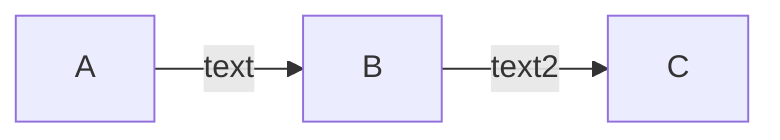

+++
title = 'Test Page'
pubdate = 2023-12-10T15:15:21-08:00
moddate = 2023-12-11T16:15:21-08:00
+++


## Header
- [ ] TODO: Smooth dark/light mode change


## Title
- [ ] TODO: Add tags
- [ ] TODO: Set up modified date


## General
- [ ] TODO: Number posts and strip in front matter
- [ ] TODO: Short description
- [ ] TODO: Move anchors to left side
- [ ] TODO: Math blocks don't auto close
- [ ] TODO: Math blocks don't auto surround
- [ ] TODO: Strikethrough doesn't auto close
- [ ] TODO: Strikethrough doesn't auto surround
- [ ] TODO: Italic doesn't auto close
- [ ] TODO: Underline doesn't auto close
- [ ] TODO: Bold doesn't auto close
- [ ] TODO: Markdown comments don't auto close

<!-- comment text -->


## To do list
- [x] One
- [ ] Two


## Syntax highlighting

- [ ] TODO: Fix line number color
- [ ] TODO: Fix missing colors
- [ ] TODO: Try to match editor theme [ref](https://gohugo.io/content-management/syntax-highlighting/#generate-syntax-highlighter-css)
- [ ] TODO: Ids for code blocks
- [ ] TODO: Can't set lineAnchors [ref](https://discourse.gohugo.io/t/anchorlinenos-true-attribute-doesnt-work-when-using-code-fences/36564/3)

### JSON
```json {lineanchors=json}
{
	"label": "hugo build",
	"type": "shell",
	"command": "hugo",
}
```

### C++
```cpp {lineanchors=cpp,hl_lines="4-5"}
inline u32 IndexToHandle(u32 index, u8 generation)
{
	Assert(index <= MaxIndex);
	u32 handle = ((index + 1) << IndexShift) | generation;
	return handle;
}
```


## Diagrams
### Goat
- [ ] TODO: Make it smaller

```goat
      .
      |
  .---+---.
  |       |
.-+-.   .-+-.
|   |   |   |
1   2   3   4
```
### Mermaid



## Comments
- [ ] TODO: Implement


## Footer
- [ ] TODO: Remove existing
- [ ] TODO: Fix a typo button
- [ ] TODO: Report a bug button
