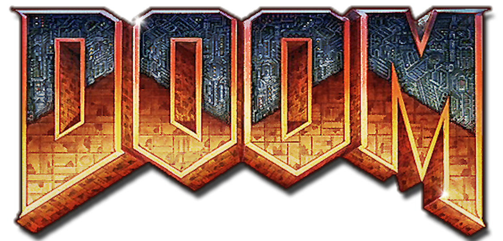

+++
title = 'Review Me'
+++

## Basics

### Text
Lorem ipsum dolor sit amet, consectetur adipiscing elit. Aenean sagittis porttitor nisl, at congue sem rutrum lobortis. Phasellus suscipit libero odio, sed vulputate nisi euismod eu. Suspendisse ornare tristique ipsum, quis dignissim erat tempus non. Duis aliquam est sed justo vulputate, in pharetra erat eleifend. Aenean consequat ultrices ex. Etiam condimentum mollis lorem, in tincidunt massa pulvinar sit amet. Ut non libero nisi. Morbi ac est sed dui tempus pellentesque ut at tellus. Integer commodo arcu mollis pellentesque aliquam. Integer pulvinar pretium ex.

Donec ac commodo orci. Donec a tempus elit. Etiam sit amet suscipit justo. Aliquam erat volutpat. Integer id gravida dui, ac condimentum tellus. Etiam sit amet consectetur tortor. Nullam id sagittis velit. Vestibulum quis posuere metus, non porta elit. Nulla non turpis sed felis tempus euismod. Vivamus et arcu tristique, molestie tortor commodo, mattis leo. Ut interdum semper blandit. Praesent non quam mauris. Vivamus sollicitudin sem ac ante sagittis, non dignissim magna egestas.

Aliquam enim est, iaculis eu nulla ac, ornare varius massa. Curabitur sed facilisis diam. Sed euismod sapien ante, vel tempor velit finibus at. Morbi mi felis, consequat vel risus pretium, posuere pulvinar lorem. Fusce nulla orci, accumsan a velit a, fermentum ultricies tortor. Nam consequat pretium metus, et rhoncus nibh vehicula congue. Cras ut quam rhoncus, pulvinar ante vel, suscipit sapien. In eget mollis augue. Nunc rhoncus metus ut neque mollis, quis varius mi consequat.


### Links
[Link](http://example.com "Alt Text")

http://example.com/#example_example_example_example_example_example_example_example_example_example_example_example_example_example_example_example_example

### Headers
# H1
## H2
### H3
#### H4
##### H5
###### H6

### Horizontal Rule
---

### Typographic replacements
"double quotes" \
'single quotes' \
<<angle quotes>> \
ellipsis ... \
en dash -- \
em dash ---

### Emphasis
**Bold** (__alternate__) \
*Italic* (_alternate_) \
~~Strikethrough~~

### Extras
Superscript 19^th^ \
Subscript H~2~O \
~~Deleted~~ \
++Inserted++ \
==Mark==

### Blockquotes
> Quote 1
>> Quote 2
>>> Quote 3

### Callouts (Alerts)
> [!NOTE]+
> Useful information that users should know, even when skimming content.

> [!TIP]-
> Helpful advice for doing things better or more easily.

> [!IMPORTANT]
> Key information users need to know to achieve their goal.

> [!WARNING]
> Urgent info that needs immediate user attention to avoid problems.

> [!CAUTION]
> Advises about risks or negative outcomes of certain actions.

### Lists
Task list
- [x] One
- [ ] Two Two Two Two Two Two Two Two Two Two Two Two Two Two Two Two Two Two Two Two Two Two Two Two Two Two Two Two Two Two Two Two
	- [ ] Sub
		- [ ] Sub
			* Unordered
				1. Ordered

Unordered
* One
* Two Two Two Two Two Two Two Two Two Two Two Two Two Two Two Two Two Two Two Two Two Two Two Two Two Two Two Two Two Two Two Two
	* Sub
		* Sub
			- [x] Task list
				1. Ordered

Ordered
1. One
1. Two Two Two Two Two Two Two Two Two Two Two Two Two Two Two Two Two Two Two Two Two Two Two Two Two Two Two Two Two Two Two Two
	1. Sub
		1. Sub
			- [x] Task list
				* Unordered

### Tables
| Number | Text  |
| ------ | ----- |
| 1      | One   |
| 2      | Two   |

| Number | Text |
| -----: | ---: |
| 1      | One  |
| 2      | Two  |

### Footnotes
Footnote [^footnote]
[^footnote]: Footnote

### Definitions
Term
:   Definition

## Code
### Inline
Some `code` embedded in a line of normal text: `{ "label": "hugo build" }` \
Some `code` embedded in a line of normal text: { "label": "hugo build" }

### Standard
```json {id=CodeStandard}
{
	"label": "hugo build",
	"type": "shell",
	"command": "hugo",
}
```

### Highlighted
```cpp {lineNoStart=999, hl_lines="1-2", #CodeHighlighted}
// long long long long long long long long long long long long long long long long long long long long
inline u32 IndexToHandle(u32 index, u8 generation)
{
	Assert(index <= MaxIndex);
	u32 handle = ((index + 1) << IndexShift) | generation;
	return handle;
}
```

### Single Line
```cpp {#CodeSingleLine}
// hello
```

### Characters
`01 airlg \/|&$@*- {} [] <> () __ -- << >> || '' ""`

```txt {#CodeCharacters}
01 airlg \/|&$@*- {} [] <> () __ -- << >> || '' ""
```

## Math
### Inline
$\sqrt{3x-1}+(1+x)^2$ \
`\sqrt{3x-1}+(1+x)^2`

Lorem ipsum dolor sit amet, consectetur adipiscing elit. \
Aenean sagittis porttitor nisl, $a^*=x-b^*$ at congue sem rutrum lobortis. \
Aenean sagittis porttitor nisl, `a^*=x-b^*` at congue sem rutrum lobortis. \
Phasellus suscipit libero odio, sed vulputate nisi euismod eu.

### Block
$$
\begin{aligned}
KL(\hat{y} || y) &= \sum_{c=1}^{M}\hat{y}_c \log{\frac{\hat{y}_c}{y_c}} \\
JS(\hat{y} || y) &= \frac{1}{2}(KL(y||\frac{y+\hat{y}}{2}) + KL(\hat{y}||\frac{y+\hat{y}}{2}))
\end{aligned}
$$
{#MathBlock}

```txt {#MathTextCompare}
\begin{aligned}
KL(\hat{y} || y) &= \sum_{c=1}^{M}\hat{y}_c \log{\frac{\hat{y}_c}{y_c}} \\
JS(\hat{y} || y) &= \frac{1}{2}(KL(y||\frac{y+\hat{y}}{2}) + KL(\hat{y}||\frac{y+\hat{y}}{2}))
\end{aligned}
```

## Images
### Transparent + Zoom

{ .transparent }

### Outline + No Zoom


### Opaque + Zoom

